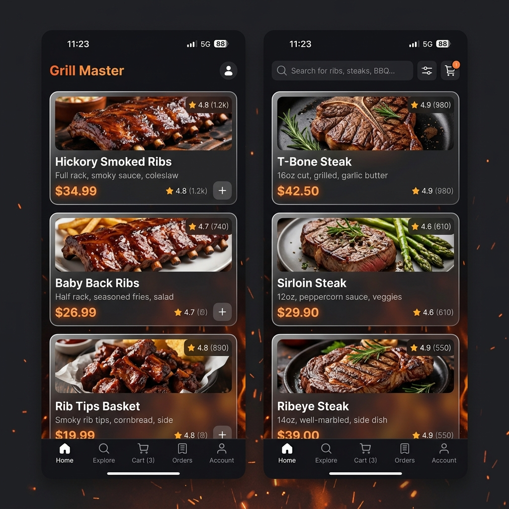
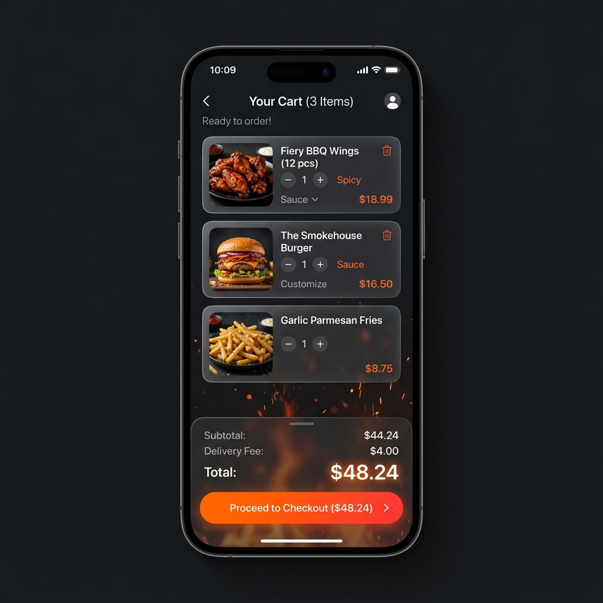

# 🔥 В РеБРО (VreBRO) - Telegram Mini App & Admin Panel

Повний стек доставки їжі для ресторану "В Ребро". Цей проект складається з трьох основних частин:
1. **Бекенд (FastAPI)** - відповідає за логіку, базу даних, Telegram-бота та інтеграцію з ШІ.
2. **Міні-додаток (React)** - клієнтська частина, яка відкривається прямо в Telegram.
3. **Панель адміністратора (React)** - веб-інтерфейс для керування меню, замовленнями та налаштуваннями.

---

## 🎨 Дизайн та Інтерфейс (Mini App)
Додаток використовує преміальний стиль **Fire Glassmorphism**:
* **Фон:** Текстура вугілля з радіальним помаранчево-червоним світінням.
* **Картки:** Напівпрозоре скло (`backdrop-blur`) для карток товарів.
* **Акценти:** Яскраві неонові тіні, які реагують на натискання.

### Екрани Додатку
*Щоб подивитися повний розмір, відкрийте зображення у папці `docs/images`.*

| Екран завантаження | Головне меню (Каталог) | Кошик |
|:---:|:---:|:---:|
|  |  |  |

---

## 🏗️ Структура Проекту та Аналіз Файлів

### 1. Бекенд (`/backend`)
Основний рушій системи. Використовує **FastAPI** для створення REST API та **SQLAlchemy** для роботи з БД.

#### Головні файли:
* **`main.py`**
  * Ініціалізація FastAPI та підключення CORS.
  * Розподіл маршрутів (монтування статики `miniapp/frontend/dist` та `admin-panel/dist`). Якщо запит йде на `/miniapp`, сервер віддає зібраний React-додаток.
  * Автоматичні міграції БД при запуску (для SQLite/PostgreSQL).
  * Реєстрація вебхуку для Telegram-бота при розгортанні на Render.
* **`bot.py`**
  * Ініціалізація `aiogram` бота. Обробляє webhook-запити від Telegram.
* **`database.py`**
  * Конфігурація підключення до бази даних (URL береться з `.env` `DATABASE_URL`).
* **`config.py`**
  * Зберігає ключі (напр. `PHOTOROOM_API_KEY`).

#### Роутери (`/backend/routers`):
* **`catalog.py`**
  * `GET /categories` - Отримання всіх категорій для фільтрації.
  * `GET /products` - Отримання активних товарів для клієнтів.
* **`orders.py`**
  * `POST /` - **Ключова функція**: Створення нового замовлення. Перевіряє наявність на складі (`stock_quantity`), підраховує підсумкову вартість, зберігає в БД та миттєво відправляє повідомлення у Telegram-чат адміністраторам.
  * `GET /user/{telegram_id}` - Історія замовлень клієнта.
* **`admin.py`**
  * Усі CRUD (Create, Read, Update, Delete) операції для управління товарами та категоріями з адмін-панелі.
* **`ai.py`**
  * `POST /remove-bg` - Інтеграція з **Photoroom API**. Вирізає об'єкти (їжу) з фотографій та повертає зображення на прозорому або покращеному фоні, яке потім вантажиться на `ImgBB`.

#### Моделі БД (`/backend/models`):
* **`product.py`** (`Product`, `Category`) - Опис полів товару: ціна, акції (`is_promo`), залишки (`stock_quantity`), та грамовка (`is_weighted`).
* **`order.py`** (`Order`, `OrderItem`) - Дані про клієнта, спосіб отримання (на винос) та деталі замовлення.
* **`user.py`** (`User`) - Профіль користувача.

---

### 2. Клієнтський Міні-Додаток (`/miniapp/frontend`)
React + Vite. Клієнт для Telegram. Усі шляхи прописані з `base: '/miniapp/'`.

#### Основні сторінки (`/src/pages`):
* **`Catalog.tsx`**
  * Показує товари (у дві колонки на мобільному).
  * Фільтрація по категоріям (горизонтальний скрол кнопок).
  * Включає кастомний анімований логотип-прелоадер "В РеБРО".
* **`ProductDetail.tsx`**
  * Велике фото, детальний опис та скляна картка для додавання товару. Адаптований градієнт для фону.
* **`Cart.tsx`**
  * Управління кошиком. Кнопки `+` і `-`. Нижня панель "Оформити" плаває поверх контенту.
* **`Checkout.tsx`**
  * Валідація даних клієнта, вибір типу доставки (зараз тільки "на винос" за вашим запитом) і передача замовлення на бекенд.
* **`MyOrders.tsx`**
  * Історія замовлень (чекає бекенд, статус: Підтверджено/Виконано).

#### Стейт Менеджмент (`/src/store`):
* **`cartStore.ts`** - Zustand store, який тримає товари в пам'яті (навіть якщо закрити додаток — вони зберігаються у `localStorage`). Робить перевірку на `is_out_of_stock`.
* **`botStore.ts`** - Дістає дані з об'єкта `window.Telegram.WebApp.initDataUnsafe` (ID, Username, Name) для ідентифікації клієнта.

---

### 3. Панель Адміністратора (`/admin-panel`)
React + Vite + Tailwind. Доступна за кореневим маршрутом `/`.

#### Основні сторінки:
* **`Orders.tsx`** 
  * Система прийому замовлень. Адміністратор може міняти статус, і це відобразиться у клієнта в історії.
* **`Products.tsx`** 
  * Комплексна сторінка управління меню.
  * Підтримує вказування залишків товарів (в кг або штуках).
  * Має кнопку **"ШІ Обробка Фото"**, куди можна закинути будь-яке фото з Telegram, а бекенд самостійно зробить з нього ідеальну картинку товару.
* **`Dashboard.tsx`** 
  * Загальна статистика замовлень (скільки продано, який виторг).
